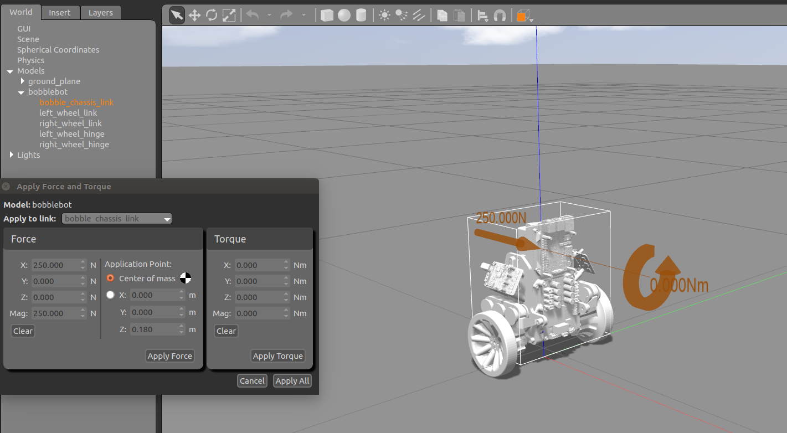

# Bobble-Bot Simulator Docker Image
> Containerized environment for the Bobble-Bot Gazebo simulation.


<a href="http://www.youtube.com/watch?feature=player_embedded&v=hS7kfhN-8V8" 
target="_blank"></a>


A Bobble-Bot simulation Docker image is available over on 
[Docker Hub](https://cloud.docker.com/u/superowesome/repository/docker/superowesome/bobble-sim). 
This repository houses the Dockerfile used to build that image and some supporting 
bash scripts to launch useful containers for various simuation analysis and 
development purposes.

If you do not know what Docker is, we highly suggest checking it out. Docker can be used 
to quickly experiment with the simulation without polluting your system with additional 
packages. See this [page](https://docs.docker.com/get-started/) to get started.
This particular image relies on [nvidia-docker2](https://github.com/NVIDIA/nvidia-docker). 
For now, an NVidia GPU is required if you want to run the graphics from within the container. 
If you only care about running the simulation headless (no graphics), then Docker is the 
only requirement.

## Quick Start

Run the simulation with graphics from within a container (master branch version of sim).

```sh
docker pull superowesome/bobble-sim:latest
mkdir -p ~/bobble_workspace/src
cd ~/bobble_workspace/src
git clone https://github.com/super-owesome/bobble_docker.git
cd bobble_docker
./run_bobble_sim.bash
```

Enable keyboard control (in a separate terminal).

```sh
cd ~/bobble_workspace/src/bobble_docker
./run_keyboard_control.bash
```


## Use for Analysis

Run the simulation headless from within a container (master branch version of sim).

```sh
docker pull superowesome/bobble-sim:latest
git clone https://github.com/super-owesome/bobble_docker.git
cd bobble_docker
./run_apply_impulse.bash
```

Note that the run_apply_impulse.bash script mounts the bobble_docker folder into the 
container and then directs the apply_impulse launch file to write the output data 
to that folder. This is a useful script for generating some sample data for analysis.

## Use for Development

Follow the steps below to launch a container intended for building the simulation 
from source.

```sh
docker pull superowesome/bobble-sim:latest
mkdir -p ~/bobble_workspace/src
cd ~/bobble_workspace/src
git clone https://github.com/super-owesome/bobble_docker.git
git clone https://github.com/super-owesome/bobble_controllers.git
git clone https://github.com/super-owesome/bobble_description.git
cd bobble_docker
./run_dev_container.bash
```

This container mounts the bobble_workspace folder in your host 
machine's home directory to /bobble_src in the container and then gives 
the user an interactive bash shell. This shell can then be used to build and run 
the simulation from within a container. We recommended that you use your favorite 
desktop editor to make code modifications, and then just use the container to build 
and launch the simulation. Execute commands like the following inside the container 
to rebuild the sim from source and run it.

```sh
cd /bobble_src
catkin config --install
catkin init
catkin build
source install/setup.bash
roslaunch bobble_controllers apply_impulse_force.launch
```

You can now freely edit the files on your host machine and simply re-run catkin 
build and roslaunch commands at will.


## More Information on Sim


Consult the [bobble_controllers](https://github.com/super-owesome/bobble_controllers) repository for instructions
on getting started with the simulation.
